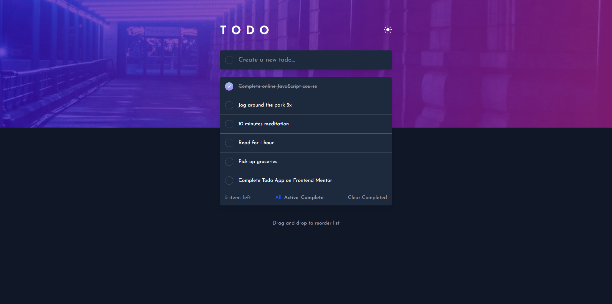

# Frontend Mentor - Todo app solution

This is a solution to the [Todo app challenge on Frontend Mentor](https://www.frontendmentor.io/challenges/todo-app-Su1_KokOW). Frontend Mentor challenges help you improve your coding skills by building realistic projects.

## Table of contents

- [Overview](#overview)

- [The challenge](#the-challenge)

- [Screenshot](#screenshot)

- [Links](#links)

- [My process](#my-process)

- [Useful resources](#useful-resources)

- [Author](#author)

## Overview

### The challenge

Users should be able to:

- View the optimal layout for the app depending on their device's screen size

- See hover states for all interactive elements on the page

- Add new todos to the list

- Mark todos as complete

- Delete todos from the list

- Filter by all/active/complete todos

- Clear all completed todos

- Toggle light and dark mode

- **Bonus**: Drag and drop to reorder items on the list

### Screenshot

### Links

- Solution URL: [Todo App Solution](https://www.frontendmentor.io/solutions/todo-app-solution-wKVAJVSAFR)

- Live Site URL: [Live Site](https://todo-app-pex-dev.netlify.app/)

## My process

### Built with

- Semantic HTML5 markup

- CSS custom properties

- CSS Flexbox

- [React](https://reactjs.org/) - JS library

- [Tailwind CSS](https://tailwindcss.com/) - For styles

### Useful resources

- [Taildwind CSS Custom Styles](https://tailwindcss.com/docs/adding-custom-styles) - it was useful for me to create custom classes and change the background

## Author

- Frontend Mentor - [@pex-dev](https://www.frontendmentor.io/profile/Pex-Dev)
